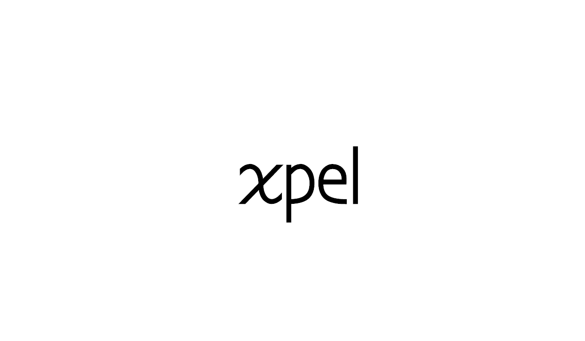

<div align="center">
  
</div>
<div align="center">
  <strong>Tiny single function event-emitter/pubsub</strong>
</div>
<div align="center">
  <a href="https://npmjs.org/package/xpel">
    
  </a>
  <a href="https://npmjs.org/package/xpel">
  
  </a>
  <a href="https://github.com/feross/standard">
    
  </a>
  <a href="https://github.com/prettier/prettier">
    
  </a>
  <a href="https://travis-ci.org/tiaanduplessis/xpel">
    
  </a>
  <a href="https://github.com/tiaanduplessis/xpel/blob/master/LICENSE">
    
  </a>
  <a href="http://makeapullrequest.com">
    
  </a>
</div>
<br>
<div align="center">
  <a href="https://github.com/tiaanduplessis/xpel/watchers">
    
  </a>
  <a href="https://github.com/tiaanduplessis/xpel/stargazers">
    
  </a>
  <a href="https://twitter.com/intent/tweet?text=Check%20out%20xpel!%20https://github.com/tiaanduplessis/xpel%20%F0%9F%91%8D">
    
  </a>
</div>
<br>
<div align="center">
  Built with ❤︎ by <a href="https://github.com/tiaanduplessis">tiaanduplessis</a> and <a href="https://github.com/tiaanduplessis/xpel/contributors">contributors</a>
</div>

<h2>Table of Contents</h2>
<details>
  <summary>Table of Contents</summary>
  <li><a href="#install">Install</a></li>
  <li><a href="#usage">Usage</a></li>
  <li><a href="#contribute">Contribute</a></li>
  <li><a href="#license">License</a></li>
</details>

## Install

```sh
$ npm install xpel
# OR
$ yarn add xpel
```

## Usage

```js
const xpel = require('xpel')

const emitter = xpel()

emitter('foo', data => console.log('foo:', data))
const unsubBar = emitter('bar', data => console.log('bar:', data))
emitter('bar', data => console.log('bar2:', data))
const unsubFoo = emitter('foo', data => console.log('foo2:', data))

// listen to all events
emitter('*', () => console.log('Things are happening!'))

// Emit
emitter('foo', 5)

// unsub foo
unsubFoo('foo')

emitter('foo', 'nothing emitted')
emitter('bar', 5)

// unsub bar
unsubBar('bar')

emitter('bar', 'baz')
emitter('foo', 'baz')

// foo: 5
// foo2: 5
// Things are happening!
// Things are happening!
/// bar: 5
// bar2: 5
// Things are happening!
// Things are happening!
// Things are happening!

```

Emitting an event without its own subscribers still notifies wildcard subscribers.
With no subscribers at all, emitting the event is a no-op. Specific subscribers
run before wildcard subscribers; emitting `'*'` itself notifies the wildcard list
once.

## Contributing

Contributions are welcome!

1. Fork it.
2. Create your feature branch: `git checkout -b my-new-feature`
3. Commit your changes: `git commit -am 'Add some feature'`
4. Push to the branch: `git push origin my-new-feature`
5. Submit a pull request :D

Or open up [a issue](https://github.com/tiaanduplessis/xpel/issues).

### Focused checks and distribution build

`npm run test:behavior` runs dependency-free behavior checks on Node 16 or newer
against source, the declared package entrypoints, and the minified UMD artifact.
Use `node test/behavior.test.js --root /path/to/extracted-package` to check a packed
package. These checks do not run the historical Jest, formatting or build tools.

The checked-in ES and UMD files can be regenerated with `npm run build:verified`
on Node 24.11 or newer. Prepare a separate `.build-tools` npm project containing
exact versions `@babel/core@8.0.7`, `@babel/preset-env@8.0.7`, `rollup@4.64.3` and
`uglify-js@3.19.3`. Resolve its lockfile with install scripts disabled, review its
package audit, then install with `npm ci --ignore-scripts`. Retain that tool
lockfile when reproducing a build; direct version pins alone do not freeze all
transitive dependencies. The package's runtime dependencies and historical build
command are unchanged.

The builder also accepts an existing isolated tool project and, optionally, a
separate minifier project:

```sh
node scripts/build-verified.mjs /path/to/build-tools /path/to/minifier-tools
```

It regenerates `dist/xpel.js`, `dist/xpel.es.js`, `dist/xpel.min.js` and its source
map. The older, undeclared `dist/xpel.common.js` artifact is not part of this build.

## License

Licensed under the MIT License.
